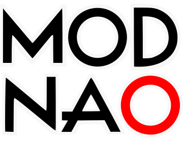

# ModNao

SEGA Dreamcast ROM model viewer/editor for Marvel vs Capcom 2, Capcom vs SNK 1 Pro, and Capcom vs SNK 2, with other games potentially supported later.

Interactively explore, edit, and export textures directly from supported ROMs, write supported changes back to ROM data, or export images for quick download in a user-friendly browser-based workflow.

Visit https://modnao.vercel.app to check it out... nao.

## Supported Titles and Formats

An updated list is maintained of which games/files are supported by this app in the panel at all times under "What Files Are Supported?".

## Credits/Acknowledgements

While there are some liberties taken for the data structures used in this project, it probably would not have gotten anywhere without the people listed below for their initial help with researching/understanding NaomiLib polygon model binary data format:

 

## Project Status & Scope

ModNao is a niche modding tool maintained around the workflows and games listed here. It is not intended to be a general-purpose ROM editor, universal model viewer, or broadly supported open source platform.

Feedback is welcome, especially around supported games and workflows, though broad feature requests or unsupported formats may not be prioritized.

*TL;DR*: **ModNao is a specialized enthusiast tool with intentionally limited scope**. Maintenance and expanded format support depend on project priorities and available time.

## License & Attribution

Code in this repository originates here. If you use, copy, modify, or redistribute any part of this project or derivative works based on it, you must attribute that work.

This project is released under a **non‑commercial, no‑AI training/modeling, copyleft license**. All rights are reserved.

See the [LICENSE](./LICENSE) file for details.